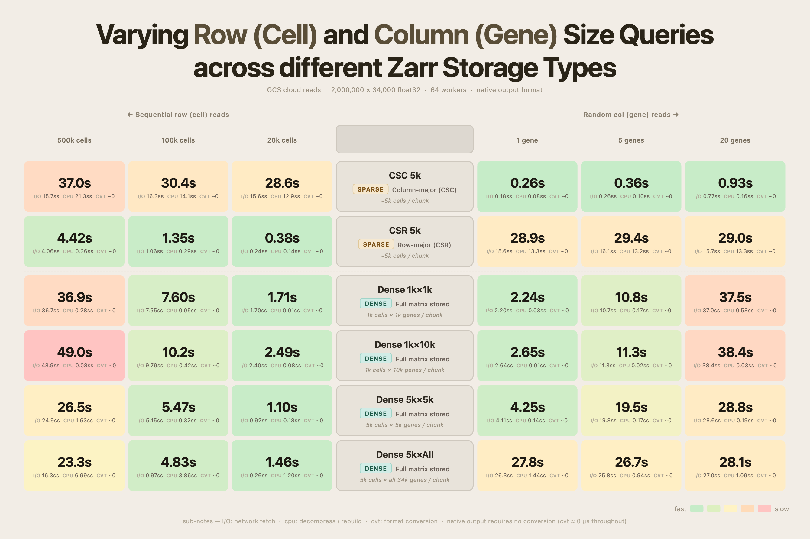
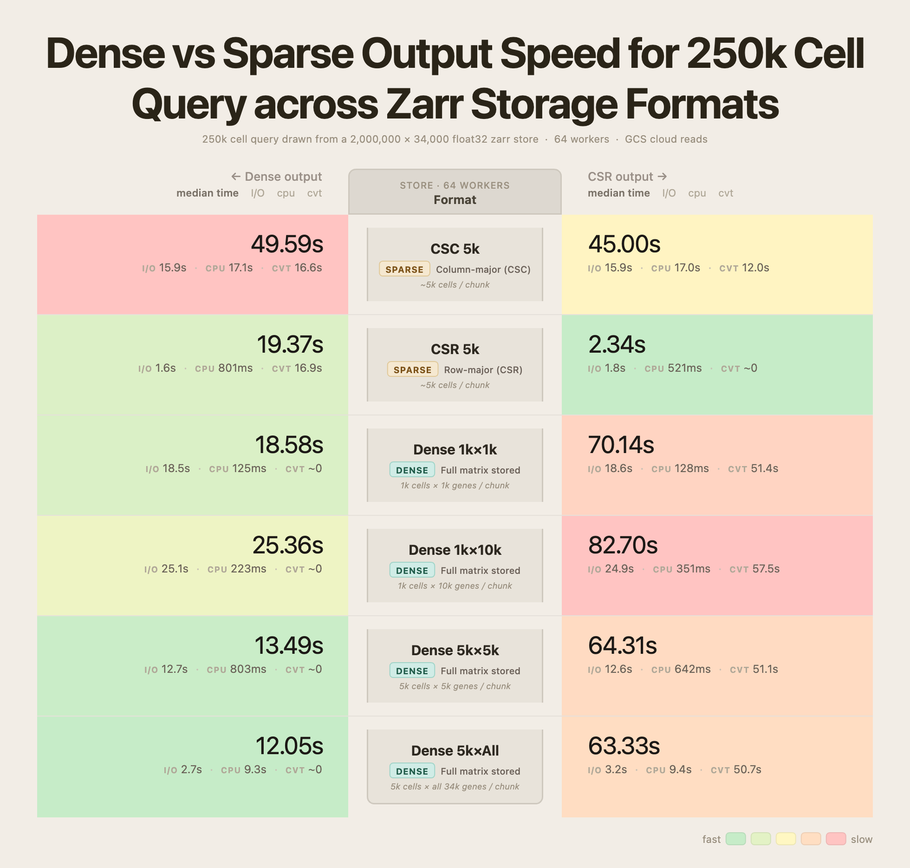
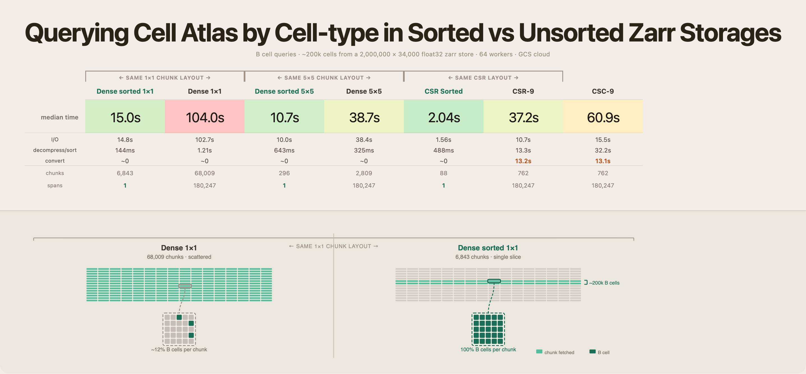
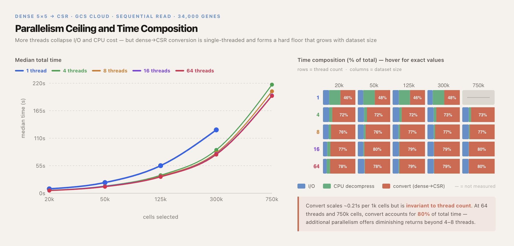

# zarr layouts — cell×gene query benchmark findings

How storage layout affects querying a cellxgene expression matrix: **dense vs sparse
(CSR/CSC)**, **cell- vs gene-axis queries**, **sorted vs unsorted rows**, and **zarr read
threading**. All runs query the same **2,000,000 × 34,000 float32** atlas (~5% nnz) written
to GCS (`gs://rapid-zarr_storage/`) in seven layouts, changing one variable at a time.

**Instrument:** every number was produced by
[`tools/zarr-query-bench`](../../tools/zarr-query-bench/README.md) (`pixi run zarr-bench`),
which times *read + convert-to-final-format* and splits each run's wall into **I/O**
(fetch-interval union), **CPU** (decompress/gather), and **convert** (the `.toarray()`/
`.tocsr()` tax). Stores were built with
[`tools/convert-to-zarr`](../../tools/convert-to-zarr/README.md) (`--sort-by` for the sorted
variants). `results/` holds the raw per-run JSON; `figures/` the plots.

**Stores under test** (figure label ↔ store file):

| Figure label | Store | Layout |
|---|---|---|
| CSR 5k | `2M_csr_9.zarr` | sparse row-major |
| CSC 5k | `2M_csc_9.zarr` | sparse column-major |
| Dense 1k×1k | `2M_dense_1x1.zarr` | dense, 1k cells × 1k genes / chunk |
| Dense 1k×10k | `2M_dense_1x1_10S.zarr` | dense, 1k×1k chunks in 10-chunk shards |
| Dense 5k×5k | `2M_dense_5x5.zarr` | dense, 5k × 5k / chunk |
| Dense 5k×All | `2M_dense_5xA.zarr` | dense, 5k cells × all 34k genes / chunk |
| Dense sorted … / CSR sorted | `2M_dense_sorted_1x1.zarr` … | same layouts, rows pre-sorted by `cell_type` |

---

## Finding 1 — match the layout to the query axis



Native-format reads (no conversion), median seconds — raw runs in [`results/colRow/`](results/colRow/):

| Store | 20k rows | 100k rows | 500k rows | 1 gene | 5 genes | 20 genes |
|---|--:|--:|--:|--:|--:|--:|
| CSR 5k | **0.38** | **1.35** | **4.42** | 28.9 | 29.4 | 29.0 |
| CSC 5k | 28.6 | 30.4 | 37.0 | **0.26** | **0.36** | **0.93** |
| Dense 1k×1k | 1.71 | 7.60 | 36.9 | 2.24 | 10.8 | 37.5 |
| Dense 1k×10k | 2.49 | 10.2 | 49.0 | 2.65 | 11.3 | 38.4 |
| Dense 5k×5k | 1.10 | 5.47 | 26.5 | 4.25 | 19.5 | 28.8 |
| Dense 5k×All | 1.46 | 4.83 | 23.3 | 27.8 | 26.7 | 28.1 |

- **Aligned sparse is unbeatable on its axis** — CSR row reads scale with the selection
  (0.38 s → 4.42 s for 25× the rows); CSC gene reads stay sub-second.
- **Cross-axis sparse pays a flat whole-store tax**: a CSR column read is ~29 s whether you
  ask for 1 gene or 20 — the run splits ≈16 s I/O + ≈13 s decompress, i.e. the entire
  compressed structure is fetched and decoded regardless of count.
- **Dense is the compromise**: no catastrophic axis, and chunk shape slides it along the
  tradeoff. Square 1k×1k makes a single gene cheap (2.24 s — one chunk column ≈ 1/34 of the
  matrix); row-wide 5k×All is the best dense layout for bulk rows (23.3 s @ 500k) but turns
  *any* column read into full-matrix I/O (~28 s for even 1 gene).
- Random gene reads on dense grow with gene count (each seeded gene lands in a different
  chunk column) — at 20 genes every dense layout has converged on the ~28–38 s whole-store cost.

## Finding 2 — the format tax: store what your pipeline consumes



The same 250k-cell sequential read, timed to **delivery in a final format** (median s, with
I/O / CPU / convert split) — raw runs in [`results/Dense_Csr/`](results/Dense_Csr/):

| Store | → dense output | → CSR output |
|---|--:|--:|
| CSR 5k | 19.37 (cvt 16.9) | **2.34** (cvt ~0) |
| CSC 5k | 49.59 (cvt 16.6) | 45.00 (cvt 12.0) |
| Dense 1k×1k | 18.58 (cvt ~0) | 70.14 (cvt 51.4) |
| Dense 1k×10k | 25.36 (cvt ~0) | 82.70 (cvt 57.5) |
| Dense 5k×5k | 13.49 (cvt ~0) | 64.31 (cvt 51.1) |
| Dense 5k×All | 12.05 (cvt ~0) | 63.33 (cvt 50.7) |

- **Matched format wins outright**: CSR→CSR is 2.34 s — 5× faster than the best
  dense→dense (12.05 s) and 27× faster than the best dense→CSR.
- **Conversion is single-threaded and dominates every mismatch**: densifying 250k×34k costs
  ~17 s on top of a 2 s read; dense→CSR costs ~51 s no matter how fast the chunks arrived.
  CSC pays twice — a cross-axis read *and* a conversion.
- This is why the tool has `--native`: with conversion excluded you're measuring the layout;
  with `--format` you're measuring what an analysis pipeline actually waits for. If the
  downstream consumer is CSR (rapids/cuML row pipelines), **store CSR**.

## Finding 3 — sort by what you query



Cell-type query (`--mode celltype`, ~200k B cells): read `obs/cell_type`, build the mask,
slice each contiguous run of matching rows. Chunk layout held identical within each pair —
only row order changes. Raw runs in [`results/sorting/`](results/sorting/):

| Layout | Unsorted | Sorted | Speedup | Chunks fetched (unsorted → sorted) |
|---|--:|--:|--:|--:|
| Dense 1k×1k | 104.0 s | 15.0 s | **6.9×** | 68,009 → 6,643 |
| Dense 5k×5k | 38.7 s | 10.7 s | **3.6×** | 2,809 → 296 |
| CSR | 37.2 s | **2.04 s** | **18×** | 762 → 88 |

- The whole effect is **locality**: unsorted, the ~200k B cells scatter into **180,247
  spans** averaging 1.1 rows — every fetched chunk is ~12% useful and shared chunks are
  re-fetched (the tool's scatter warning fires). Sorted, the same cells are **1 span**: one
  contiguous `X[start:end]` slice, every chunk 100% useful.
- The unsorted sparse reads also pick up a ~13 s convert term (the scattered gather can't
  use the contiguous fast path); the sorted CSR store answers at native format with none.
- A Dendritic-cell replicate ([`results/sorting/`](results/sorting/)) reproduces every
  number within ~10%.
- Sorted stores are plain sorted AnnData from `convert-to-zarr --sort-by cell_type` — the
  query needs no custom metadata or reader.

## Finding 4 — threading ceiling: parallelism helps until convert is the floor



Dense 5k×5k store → CSR output, sequential rows, sweeping zarr's two read knobs together
(`--concurrency N --max-workers N`). Median total seconds — raw runs in
[`results/cthr/`](results/cthr/) (an earlier warm 2-repeat sweep in
[`results/thr/`](results/thr/) agrees):

| Cells | 1 thr | 4 | 8 | 16 | 64 | convert (any thr) |
|--:|--:|--:|--:|--:|--:|--:|
| 20k | 8.7 | 5.8 | 5.4 | 5.4 | 5.2 | ~4.1 |
| 50k | 21.3 | 14.3 | 13.6 | 13.7 | 12.9 | ~10.3 |
| 125k | 55.1 | 35.9 | 34.0 | 32.9 | 32.6 | ~25.9 |
| 300k | 126.7 | 86.6 | 80.7 | 78.2 | 77.3 | ~61.9 |
| 750k | — | 217.2 | 203.8 | 195.5 | 194.6 | ~155.8 |

- Threads collapse the parallelizable part: at 300k cells, I/O + decompress falls from
  65.4 s (1 thr) to 15.9 s (64 thr).
- **Convert is single-threaded and invariant**: ~0.21 s per 1k cells at every thread count.
  It grows linearly with rows, so at 64 threads it is **80% of the 750k-cell wall** —
  additional parallelism has diminishing returns beyond 4–8 threads.
- Both knobs must move together: `--concurrency` alone only dispatches fetches;
  `--max-workers` sizes the decode pool (see the tool README's "two knobs" note).
- Connects to Finding 2: no thread count removes the format tax. If the pipeline needs CSR,
  the fix is storing CSR, not more threads.

**Warm-cache spot check** ([`results/warm_cache/Cached.txt`](results/warm_cache/Cached.txt)):
the same pattern holds off-cloud — on local warm-cache 5M-cell stores, a 500k-row CSR-output
read is 2.4–3.2 s from CSR stores vs ~120–128 s from dense or CSC (51–54× slower).

---

## Reproducing

From `tools/zarr-query-bench` (full flags in its [README](../../tools/zarr-query-bench/README.md)):

```bash
# Finding 1 — native reads, either axis
pixi run zarr-bench --store gs://…/2M_csr_9.zarr --axis row --count 100000 --native --json
# Finding 2 — same read delivered as CSR (the format tax is timed)
pixi run zarr-bench --store gs://…/2M_dense_5x5.zarr --axis row --count 250000 --format csr --json
# Finding 3 — cell-type query; compare a sorted vs unsorted store
pixi run zarr-bench --store gs://…/2M_dense_sorted_1x1.zarr --mode celltype \
    --obs-column cell_type --obs-value B_cell --format dense --json
# Finding 4 — threading sweep (set BOTH knobs)
for t in 1 4 8 16 64; do pixi run zarr-bench --store gs://…/2M_dense_5x5.zarr \
    --axis row --count 300000 --format csr --concurrency $t --max-workers $t --json; done
```

## Provenance

Recorded per-run in every JSON: `zarr 3.2.1`, `anndata 0.12.11`, `numpy 2.4.3`,
`scipy 1.17.1`; tool commits `1749f23` (I/O/CPU/convert-instrumented sets) and `8546db2`
(`thr/`). GCS reads via zarr `FsspecStore`/gcsfs, `--concurrency 64 --max-workers 64` except
the threading sweep. Instrumented cloud runs are single-shot cold-ish (`--warmup 0
--repeats 1`, fresh client cache per process); the `thr/` set is warm (`--warmup 1
--repeats 2`). `results/` covers most plotted configs; the sorted 5k×5k and sorted-CSR runs
survive only in the figure.
