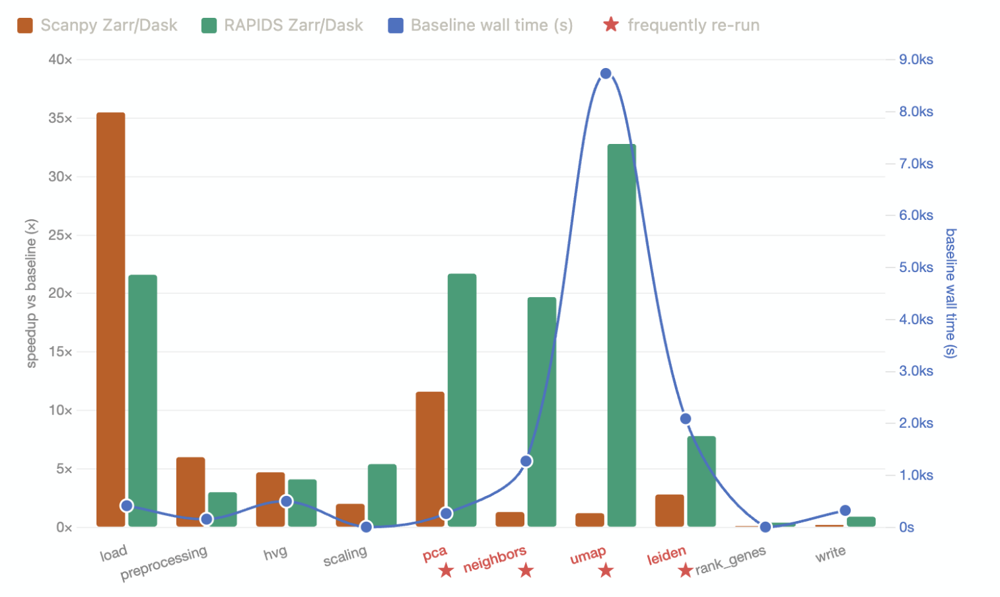
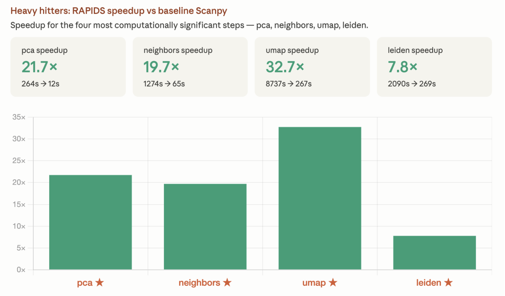
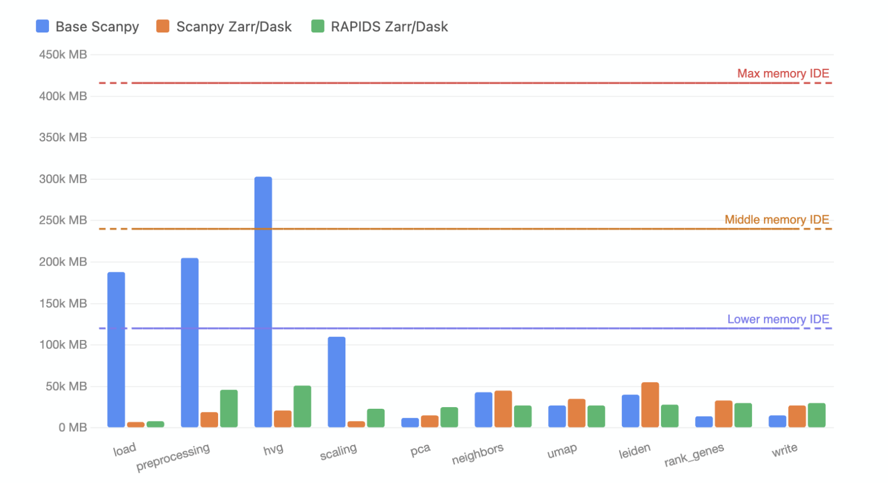

# rapids-singlecell — GPU pipeline benchmark

This directory is **two things**:

1. **Findings** — what we measured when running the standard single-cell pipeline
   (preprocess → HVG → PCA → neighbors → UMAP → Leiden) three ways: stock in-memory
   Scanpy, Scanpy streamed out-of-core from Zarr via Dask, and **rapids-singlecell on a
   multi-GPU dask-cuda cluster** reading the same Zarr store. The bulk of this README is
   those results.
2. **The tool** — [`rapids_benchmark.py`](rapids_benchmark.py), the configurable
   per-step benchmark that produced the RAPIDS numbers, plus [`sweep_gpu_zarr.sh`](sweep_gpu_zarr.sh)
   for GPU-count / read-config sweeps.

**Headline (5M-cell PBMC, 4× GPU):** the RAPIDS pipeline runs the full analysis in
**~20 min vs ~3h49m** for baseline Scanpy (**11.6×**) while holding peak host RAM to
**~50 GB vs ~295 GB** (**~6× lower**). Per-step, the win concentrates exactly where it
matters — UMAP **32.7×**, PCA **21.7×**, neighbors **19.7×**.

---

## The benchmark tool (brief)

[`rapids_benchmark.py`](rapids_benchmark.py) times **wall-clock + peak host RSS
(process tree) + peak GPU VRAM (NVML, device-wide)** for each stage of an out-of-core,
multi-GPU pipeline that reads a Zarr store lazily through Dask-CUDA:

```
load_zarr → h2d_transfer → preprocessing (qc+normalize+log1p) → hvg → scaling
          → pca → harmony (if --batch-key) → neighbors → umap → leiden → write_results
```

Every field of the `Config` dataclass has a matching `--flag`, so a sweep is a shell loop —
no source edits. GPU/CUDA-only; run it on the GPU node's pixi env (`--help` works anywhere).

```bash
# 4-GPU run, capacity preset (tcp + managed memory)
pixi run python rapids_benchmark.py \
    --data-path /path/to/5M.zarr --gpus 0,1,2,3 --label 5M_4gpu
```

Key knobs: `--gpus` (physical ids, single-sourced to cluster + NVML + client RMM),
`--preset capacity|speed`, `--zarr-concurrency`/`--zarr-max-workers` (applied on *every*
worker), `--chunk-rows`, and the pipeline params (`--n-top-genes`, `--n-comps`,
`--n-neighbors`, `--leiden-resolution`, `--batch-key ""` to skip harmony). By default the
final step writes the UMAP embedding (`obsm/X_umap`) and leiden labels (`obs/leiden`) back
**into the input store** as an anndata-readable layer — no h5ad, no X rematerialization;
`--results-store` retargets it, `--no-write-results` skips it. Each run also appends a
per-step summary to `results/Run_results.txt` headed by the date, store, GPUs, and any cfg
options left off their defaults. See the module docstring and `--help` for the rest.

---

## Findings

### What was compared

Three implementations of the **same** pipeline, on the **same** Zarr stores:

| Series | What | Device |
|--------|------|--------|
| **Base Scanpy** | stock scanpy, `X` read fully into memory from `.h5ad` | CPU |
| **Scanpy Zarr/Dask** | stock scanpy, `X` streamed out-of-core from Zarr via Dask | CPU |
| **RAPIDS Zarr/Dask** | rapids-singlecell on a 4-GPU `dask-cuda` cluster, same Zarr streamed to device | GPU |

Baseline Scanpy is the "what everyone does today" reference. Speedups below are **vs Base
Scanpy** unless noted. All figures are the **5M-cell PBMC** run; cross-dataset totals are
in the table at the end. Caches were warm for repeat steps and cold on first touch (page
cache can't be dropped without root) — reported, not hidden.

### Per-step speedup — where the time goes



Bars are speedup vs baseline for each pipeline; the **blue line is the baseline wall time**
per step (right axis). Two things stand out:

- **Baseline cost is wildly concentrated.** UMAP alone is ~8.7 ks (2.4 h), then Leiden
  ~2.1 ks and neighbors ~1.3 ks. These are precisely the steps you re-run while tuning
  resolution / min-dist / n-neighbors — so their cost dominates real iterative work.
- **Only the GPU cracks the expensive steps.** Scanpy Zarr/Dask (orange) helps I/O-ish
  steps (load 35×, PCA 12×) but is ~1× on UMAP and Leiden — those are CPU-compute-bound, so
  streaming the data doesn't help. RAPIDS (green) is tallest exactly where the baseline is
  most expensive: **32.7× on UMAP**, the single biggest lever.

### Heavy hitters — the four steps worth accelerating



Zooming into the four steps that dominate an interactive session — **PCA, neighbors, UMAP,
Leiden** — RAPIDS vs baseline Scanpy:

| Step | Baseline → RAPIDS | Speedup |
|------|-------------------|--------:|
| PCA | 264 s → 12 s | **21.7×** |
| neighbors | 1274 s → 65 s | **19.7×** |
| UMAP | 8737 s → 267 s | **32.7×** |
| Leiden | 2090 s → 269 s | **7.8×** |

UMAP goes from a coffee-break-plus-lunch (2.4 h) to **~4.5 min**. Leiden shows the smallest
multiple (7.8×) but still turns 35 min into ~4.5 min.

### Memory — Dask streaming is what makes it fit



Peak host RAM per step; dashed lines mark the RAM ceilings of the three compute tiers
available to us. The story is **the Zarr/Dask streaming path — not the GPU — collapses
memory**:

- Base Scanpy spikes to **~295 GB** at HVG (and >200 GB through load/preprocess/scaling),
  clearing only the *top* tier. You'd have to provision the biggest box just to open the data.
- Both streamed pipelines stay flat and low: **Scanpy Zarr/Dask ~53 GB**, **RAPIDS
  Zarr/Dask ~50 GB** peak host — each **~6× lower** than baseline and comfortably under the
  *smallest* tier. RAPIDS additionally holds **~48 GB VRAM** across the 4 GPUs.

So the two axes are independent: **Dask streaming buys the memory ceiling** (run it on a
small machine at all), **the GPU buys the wall-clock**.

### Totals across datasets

Full-pipeline wall time and peak memory. RAPIDS = 4× GPU. Speedup is vs Base Scanpy where a
baseline exists, else vs Scanpy Zarr/Dask (†).

| Dataset (~cells) | Pipeline | Total wall | Peak host | Peak VRAM | Speedup |
|------------------|----------|-----------:|----------:|----------:|--------:|
| **5M PBMC** | Base Scanpy | 3 h 49 m | 295 GB | — | 1× |
| | Scanpy Zarr/Dask | 3 h 08 m | 53 GB | — | 1.2× |
| | **RAPIDS Zarr/Dask** | **19.8 min** | **50 GB** | 48 GB | **11.6×** |
| **2M Soundlife Misc** | Base Scanpy | 1 h 37 m | 214 GB | — | 1× |
| | Scanpy Zarr/Dask | 56.3 min | 42 GB | — | 1.7× |
| | **RAPIDS Zarr/Dask** | **6.8 min** | 56 GB | 38 GB | **14.2×** |
| **13M Soundlife Single-Cell** | Base Scanpy | — *(didn't fit)* | — | — | — |
| | Scanpy Zarr/Dask | 10 h 01 m | 147 GB | — | 1× † |
| | **RAPIDS Zarr/Dask** | **1 h 26 m** | 92 GB | 52 GB | **7.0×** † |

At 13M cells, in-memory baseline Scanpy no longer fits — the streamed pipelines are the only
options, and RAPIDS turns a **10-hour** CPU run into **~1.4 h**.

---

## Multi-GPU scaling: 1 vs 4 GPUs

Full sweep in [`results/multi-gpu.csv`](results/multi-gpu.csv): the same 5M sorted store run
at **1 GPU** (`ivfflat`) and **4 GPUs** (`mg_ivfflat`), each across a `--zarr-concurrency` ×
`--zarr-max-workers` grid (chunk shape, codec, and preset held constant so GPU count is the
variable). Values below are the **median** over each GPU count's grid.

**4 GPUs cut total wall ~1.3×, not ~4×** — median full-pipeline **~17.7 min (1 GPU) →
~13.3 min (4 GPU)**. It falls well short of linear because the two dominant steps don't scale:

| Step (median) | 1 GPU | 4 GPU | Scaling |
|---|---:|---:|---:|
| preprocessing | 138 s | 46 s | ~3× |
| HVG | 259 s | 104 s | ~2.5× |
| neighbors | 104 s | 60 s | ~1.7× |
| UMAP | 319 s | 327 s | ~1× (flat) |
| Leiden | 230 s | 230 s | ~1× (flat) |
| **total** | **1065 s** | **795 s** | **~1.3×** |

UMAP + Leiden are ~70% of the 4-GPU wall and are effectively single-GPU-bound, so extra GPUs
only speed up the parallel front half (preprocess / HVG / neighbors). Within each GPU count the
read-config sweep mostly moves preprocessing/HVG: `--zarr-max-workers 1` starves host decode
(preprocessing ~80 s vs ~44 s at 4 GPU) while `w4`–`w16` are all near-optimal — decode threads,
not fetch concurrency, are the lever. Cost of the extra GPUs is host RAM: ~50–60 GB peak
(4 GPU, 16 workers) vs ~18–40 GB single-GPU, and ~48 GB VRAM spread over 4 devices vs ~15 GB
on one.
