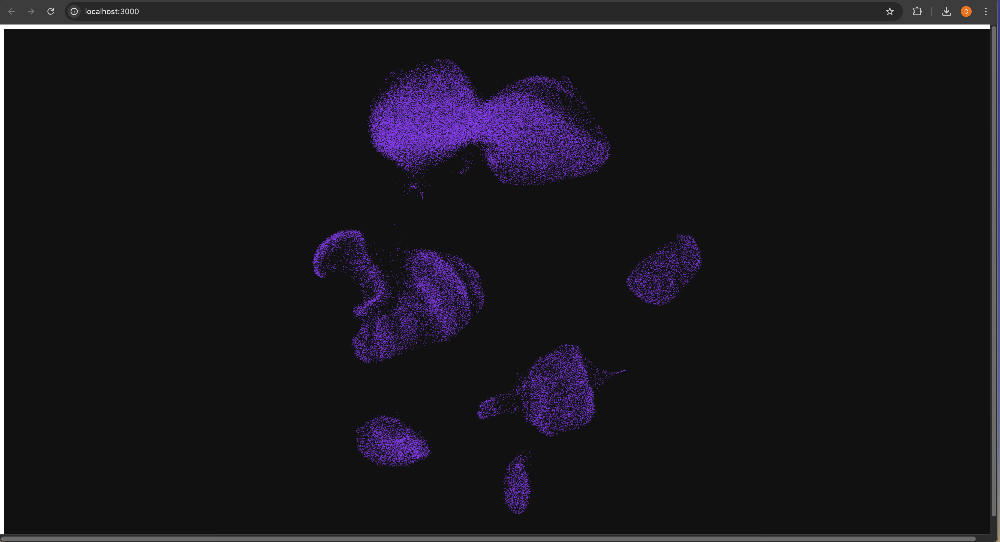

# DataScales UMAP POC

A React + deck.gl + zarrita proof-of-concept, built with Vite and Bun. A FastAPI backend serves the zarr store to the frontend at `/api/data`.



---

## Prerequisites

### Install Bun

```bash
curl -fsSL https://bun.sh/install | bash
```

Then restart your terminal (or source your shell profile) so `bun` is on your PATH.

### Install Docker

Download and install Docker Desktop for your platform from https://docs.docker.com/get-docker/, then start the Docker Desktop app.

---

## Data

`DATA_DIR` points at the root of an AnnData zarr v3 store — the directory (or GCS prefix) containing `zarr.json`. It can be a local path (`./data/soundlife-other-tiny.zarr`) or a private GCS store (`gs://my-bucket/path/store.zarr`, read with your Google credentials — see [Docker deployment](#docker-deployment-gcs)).

One store serves everything:

- `obsm/X_umap` — the coordinates the viewer renders (`(n_obs, 2)`, scanpy layout)
- `X/` (best if csr) — what the GPU pipeline consumes
- `layers/gexp` (csc or dense; `zarrsmith add-expr` creates it) — gene-expression highlighting, resolved in order `layers/gexp` → dense `X` → CSC `X`
- `umap_views/`, `groups.json`, `jobs/` — written by the app: returned views, the view listing, and the GPU job queue + status objects

In the app: lasso a cell selection, name it, and hit "GPU run". The backend writes the job to `jobs/submitted/<id>.json` in the store, then dispatches one **cold run** on the GPU box over `gcloud compute ssh`: `gpu/gpu_job.sh` sets up the pixi env fresh, runs `gpu/rerun_umap_on_selection.py` against the store, and uploads the view to `umap_views/<slug>`. The script reports each stage to `jobs/status/<id>.json`; the runs panel polls it (live timer + stage) and marks the view ready in the View picker — no auto-switch. Views are deletable from the picker (✕).

GPU runs require `GPU_INSTANCE`, `GPU_ZONE`, and `GPU_PIXI_DIR` (the pixi project on the box) in `.env` — submits error if any is unset. Works in docker (the backend image ships gcloud + your mounted credentials/ssh keys) and in dev mode. One-time per bucket: grant the GPU instance's service account storage access so jobs on the box can read/write the store no matter who sshs in:

```bash
gcloud storage buckets add-iam-policy-binding gs://MY_BUCKET \
  --member="serviceAccount:<instance-service-account>" --role="roles/storage.objectAdmin"
```

---

## Local dev

### Python setup (first time)

```bash
cd datavis_realtime_analysis
pip install -r server/requirements.txt
```

### dev Run

```bash
DATA_DIR=./data/soundlife-other-tiny.zarr bun run dev
```

This starts both servers concurrently:
- Vite (frontend) → http://localhost:3000
- FastAPI (backend) → http://localhost:8000

Frontend requests to `/api/*` are proxied to the FastAPI server.

To run the servers separately:

```bash
bun run dev:frontend
DATA_DIR=./data/soundlife-other-tiny.zarr uvicorn server.main:app --reload
```

---

## Docker deployment (GCS)

Two services via compose: nginx serves the built frontend and proxies `/api`; the FastAPI backend reads the store from GCS.

### 1. Configure `.env`

Create `.env` in the repo

```bash
DATA_DIR=gs://MY_BUCKET/store.zarr
GPU_INSTANCE=my-gpu-instance
GPU_ZONE=us-central1-c
GPU_PIXI_DIR=/path/on/box/to/pixi-project
```

- `DATA_DIR` — the zarr store everything runs against (a `gs://` prefix, or a local path for dev).
- `GPU_INSTANCE` — the GCE instance name GPU jobs are dispatched to over `gcloud compute ssh`.
- `GPU_ZONE` — that instance's compute zone.
- `GPU_PIXI_DIR` — the pixi project directory on the instance whose env the pipeline runs in.


### 2. Authenticate (once per machine)

```bash
gcloud auth login                       # CLI credential — GPU dispatch (compute ssh/scp)
gcloud auth application-default login   # ADC — the fastAPI backend's GCS reads/writes
gcloud config set project MY_PROJECT
```

Credentials land under `~/.config/gcloud`, which compose mounts read-only into the backend container. Your account needs `roles/storage.objectAdmin` on the bucket; GPU runs also need instance SSH rights (`roles/compute.osLogin` or `instanceAdmin.v1`) plus `roles/iam.serviceAccountUser` on the instance's service account.

test GPU access (also generates the ssh key compose mounts in):
```bash
gcloud compute ssh MY_GPU_INSTANCE --zone=MY_ZONE --command='echo ok'
```


### 3. Build and run

```bash
docker compose up --build -d
```

App: http://localhost:3000

### 4. Verify & monitor

```bash
docker compose logs -f backend       
```

### Troubleshooting

- `Reauthentication required/failed` on GPU submit — the org session policy expires user credentials (~weekly). Re-run both `gcloud auth` commands on the **host**, then `docker compose restart backend` (credentials are copied in at container start). The GPU box never needs reauth — jobs there run as the instance's service account.
- `503 GCS auth failed` — re-run step 1 on the host; confirm `~/.config/gcloud/application_default_credentials.json` exists.
- `port is already allocated` — something else is publishing 3000/8000; `docker ps`, then stop it.

`docker compose down` stops the stack. For a local store instead of GCS, uncomment the data volume in `docker-compose.yml` and run with `DATA_DIR=/data`.
