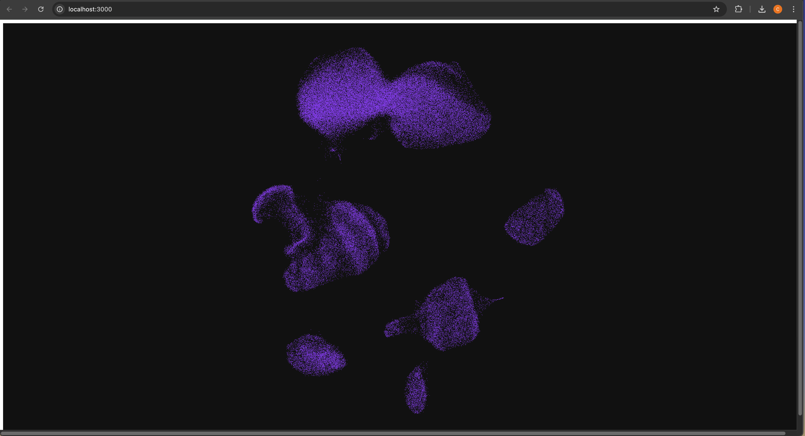

# DataScales UMAP POC

A React + deck.gl + zarrita proof-of-concept, built with Vite and Bun. A FastAPI backend serves the zarr store to the frontend at `/api/data`.



---

## Prerequisites

### Install Bun

```bash
curl -fsSL https://bun.sh/install | bash
```

Then restart your terminal (or source your shell profile) so `bun` is on your PATH.

### Install Docker

Download and install Docker Desktop for your platform from https://docs.docker.com/get-docker/, then start the Docker Desktop app.

---

## Data

`DATA_DIR` points at the root of an AnnData zarr v3 store — the directory (or GCS prefix) containing `zarr.json`. It can be a local path (`./data/soundlife-other-tiny.zarr`) or a private GCS store (`gs://my-bucket/path/store.zarr`, read with your gcloud credentials — see [Deploy on the GPU VM](#deploy-on-the-gpu-vm)).

One store serves everything:

- `obsm/X_umap` — the coordinates the viewer renders (`(n_obs, 2)`, scanpy layout)
- `X/` (best if csr) — what the GPU pipeline consumes
- `layers/gexp` (csc or dense; `zarrsmith add-expr` creates it) — gene-expression highlighting, resolved in order `layers/gexp` → dense `X` → CSC `X`
- `umap_views/`, `groups.json`, `jobs/history/` — written by the app: returned views, the view listing, and one record per finished GPU job

In the app: lasso a cell selection, name it, and hit "Generate New UMAP". The backend queues the job in memory and runs it in its own GPU container: a **warm pipeline process** (`gpu/worker.py`) does the heavy imports + CUDA init once, runs `gpu/rerun_umap_on_selection.py`'s pipeline per job, and writes the view straight to `umap_views/<slug>` in the store. Stage updates stream over the worker's stdout into the runs panel (live timer + stage); the view goes ready in the View picker — no auto-switch. The worker exits after 15 min idle (GPU memory frees) and respawns on the next submit. Views are deletable from the picker (✕); running jobs are cancellable via `DELETE /api/jobs/<id>`.

---

## Local dev

### Python setup (first time)

```bash
cd datavis_realtime_analysis
pip install -r server/requirements.txt
```

### dev Run

```bash
DATA_DIR=./data/soundlife-other-tiny.zarr bun run dev
```

This starts both servers concurrently:
- Vite (frontend) → http://localhost:3000
- FastAPI (backend) → http://localhost:8000

Frontend requests to `/api/*` are proxied to the FastAPI server.

To run the servers separately:

```bash
bun run dev:frontend
DATA_DIR=./data/soundlife-other-tiny.zarr uvicorn server.main:app --reload
```

---

## Deploy on the GPU VM

nginx serves the built frontend and proxies `/api` to the FastAPI backend; one published port, **8000**. The backend container has the GPU and runs the rapids pipeline itself (env baked into the image from `server/pixi.toml`).

### 1. Authenticate (on the VM)

```bash
gcloud auth login --no-launch-browser
gcloud auth application-default login --no-launch-browser
```

The second command writes `~/.config/gcloud/application_default_credentials.json`, which compose mounts into the backend — that is the app's GCS credential. Your account needs `roles/storage.objectAdmin` on the bucket. The org policy expires these credentials roughly weekly: re-run both commands and `docker compose restart backend`.

### 2. Run

Once per VM: docker + compose plugin, and the NVIDIA container toolkit:

```bash
sudo apt install nvidia-container-toolkit
sudo nvidia-ctk runtime configure --runtime=docker && sudo systemctl restart docker
```

Then, from the checkout:

```bash
echo DATA_DIR=gs://MY_BUCKET/store.zarr > .env
docker compose up -d --build   # first build pulls the rapids env: slow once, ~6.5 GB image
```

If the checkout lives on the VM's local SSD, it is wiped on every stop/start — re-clone and run this again after a restart.

### 3. Access from your laptop

Set `GPU_INSTANCE` and `GPU_ZONE` at the top of `deploy/tunnel.sh`, then:

```bash
<<<<<<< HEAD
deploy/tunnel.sh    # IAP ssh tunnel → http://localhost:8000
```

### 4. Troubleshoot
=======
deploy/tunnel.sh          # IAP TCP tunnel → http://localhost:8000
deploy/tunnel.sh --ssh    # fallback: forward over plain gcloud ssh — needs only ssh access
```

The IAP tunnel needs `roles/iap.tunnelResourceAccessor` plus a firewall rule allowing `35.235.240.0/20 → tcp:8000` (an IAP `4033: not authorized` means the role is missing). Without those, the `--ssh` fallback port-forwards over the ssh access you already have.
>>>>>>> 916e262 (adding script to open port access to local viewer)

- A red **GPU runs** rail badge shows the failing step with fix commands (expired credential, bucket access, container can't see the GPU). Hit *Re-check* after fixing.
- Logs: `docker compose logs -f backend`. Stop: `docker compose down`.
