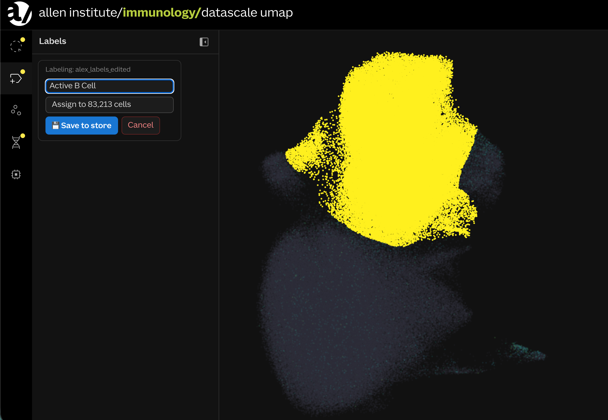

# Realtime Labeling Analysis App



A browser app for labeling cells on a UMAP and re-clustering any selection on a GPU, in real time, against a single AnnData zarr v3 group — a standalone store, or one modality (`mod/<name>`) of a multimodal MuData-layout store.

**How it is deployed.** The app runs on a GCP GPU VM as two containers (`docker compose`): nginx serves the built React + deck.gl frontend and proxies `/api` to a FastAPI backend that owns the GPU. The backend reads and writes one AnnData group set by `DATA_DIR` — normally a private GCS bucket (`gs://bucket/store.zarr` or `gs://bucket/store.zarr/mod/atac`, authenticated with the VM user's gcloud credentials), or a local path on disk. Nothing is copied: the frontend streams zarr chunks through the backend proxy, and the two things the app produces (labelsets, new UMAP views) are written back into the same group. You reach the app from your laptop through an IAP ssh tunnel on port **8000**.

**What it does.**

- **Labeling** — lasso cells, name a label, and *Save to store*. Labelsets are written onto the store's `obs` as anndata categorical columns (`-1` = unlabeled), so they are readable by scanpy/anndata immediately. Assignments travel as barcodes, so labels made inside a re-clustered view land on the root store.
- **Re-clustering on the GPU** — lasso a selection and hit *Generate New UMAP*. The backend runs the RAPIDS single-cell pipeline on just those cells and writes the result to `umap_views/<name>` in the store. scRNA goes normalize → HVG → PCA → neighbors → UMAP from raw counts; a store whose neighbor graph came from a stored latent space (scATAC with a PeakVI embedding in `obsm`, recorded in `uns/neighbors/params/use_rep`) skips straight to neighbors → UMAP from that latent and never reads `X`. This is why the backend lives on a GPU: a sub-UMAP of tens of thousands to a few million cells comes back in seconds to minutes instead of hours, so you can drill into a population, re-embed it, label the sub-structure that appears, and repeat. A warm worker process keeps the CUDA context between jobs; selections ≤ 500k cells run eagerly on one GPU, larger ones stream through a per-run dask-cuda cluster.
- **Gene expression highlighting** — color the embedding by any gene, read from a log-normalized expression layer in the store (see [Data](#data)). The Genes panel only appears when the store has such a layer; an ATAC group without one simply has no gene panel.

---

## Connect to a running deployment

The VM is not exposed publicly. `deploy/tunnel.sh` opens an IAP ssh tunnel from your laptop to the VM's port 8000.

1. Make sure you are logged in to gcloud on your laptop (`gcloud auth login`) with an account that has IAP-secured tunnel access to the instance.

2. Open the deploy/tunnel.sh script, and fill in the GPU_INSTANCE and ZONE with the credentials. Then run the script and leave it open:

   ```bash
   deploy/tunnel.sh
   ```

4. Open http://localhost:8000.

The script uses `gcloud compute ssh --tunnel-through-iap -- -N -L 8000:localhost:8000`. If your account has `iap.tunnelInstances.accessViaIAP` but no ssh access, swap in the commented `gcloud compute start-iap-tunnel` line instead.

---

## Deploy on the GPU VM

### Requirements

- NVIDIA driver ≥ 580 (CUDA 13) and a Volta-or-newer GPU — check `nvidia-smi` before building. The backend image ships the CUDA 13.4 runtime and RAPIDS 26.6 (`cu13` wheels pinned in `server/pixi.lock`).
- Docker with the compose plugin, plus the NVIDIA container toolkit (once per VM):

  ```bash
  sudo apt install nvidia-container-toolkit
  sudo nvidia-ctk runtime configure --runtime=docker && sudo systemctl restart docker
  ```

### 1. Authenticate to GCS (on the VM)

```bash
gcloud auth login --no-launch-browser
gcloud auth application-default login --no-launch-browser
```

The second command writes `~/.config/gcloud/application_default_credentials.json`, which compose mounts read-only into the backend — that is the app's GCS credential. The account needs `roles/storage.objectAdmin` on the bucket (the app writes labels and views back). The org policy expires these credentials roughly weekly: re-run both commands and `docker compose restart backend`.

### 2. Point at the store and start

From the checkout:

```bash
echo DATA_DIR=gs://MY_BUCKET/path/store.zarr > .env
docker compose up -d --build   # first build pulls the rapids env: slow once, ~6.5 GB image
```

`DATA_DIR` is an AnnData group — the prefix that contains its `zarr.json`: a store root, or `…/store.zarr/mod/<name>` for one modality of a MuData-layout store (see [build_mm_multimodal](../build_mm_multimodal/BUILD_SPEC.md)). Switching modality is a redeploy with another `DATA_DIR`. To serve a store on the VM's disk instead, set `DATA_DIR` to that path and add a matching volume mount for the `backend` service in `docker-compose.yml` (the compose file only mounts gcloud credentials and `gpu/` by default).

If the checkout lives on the VM's local SSD, it is wiped on every stop/start — re-clone and run this again after a restart.

### 3. Operate

- Logs: `docker compose logs -f backend`
- Stop: `docker compose down`
- Pipeline edits in `gpu/` take effect without a rebuild (the directory is bind-mounted); the worker respawns on the next job after 15 min idle, or restart the backend.
- A red **GPU runs** badge in the app shows the failing step with fix commands (expired credential, bucket access, container can't see the GPU). Hit *Re-check* after fixing. Running jobs can be cancelled from the runs panel or via `DELETE /api/jobs/<id>`; views are deletable from the view picker.

---

## Data

`DATA_DIR` points at one AnnData zarr v3 group — the directory or GCS prefix containing its `zarr.json`. That group serves everything the app reads and writes:

| Path | Who | What |
|---|---|---|
| `obsm/X_umap` | read | Coordinates the viewer renders, `(n_obs, 2)` float32 (scanpy layout) |
| `obs/` | read + write | Cell metadata; the index (`_index`) must be unique. Labelsets are added here as categorical columns |
| `X/` | read (GPU) | Raw counts for the scRNA re-clustering pipeline — CSR is strongly preferred |
| `obsm/<latent>` + `uns/neighbors/params/use_rep` | read (GPU) | A stored latent space (e.g. PeakVI for ATAC): when present the pipeline re-embeds from it instead of `X` |
| `layers/gexp` | read | Log-normalized expression for gene highlighting, CSC or dense. Falls back to dense `X`, then CSC `X`; absent → no Genes panel |
| `umap_views/<slug>/` | write | Re-clustered views (small AnnData groups: `obs` + `obsm/X_umap`), labelled by a `datavis-label` root attribute |

Views are listed by reading the `umap_views/` children, and the GPU job queue and history live in backend memory — nothing but AnnData groups and `obs` columns is ever written to the store.

Build the store with [AnniZarr](https://github.com/A-Jolly-Holly/annizarr) (`annizarr convert sample.h5ad -o store.zarr`), then add the expression layer with its `add-expr`, which writes a log-normalized `layers/gexp` in the column-friendly layout the gene highlighter needs:

```bash
annizarr add-expr path/to/store.zarr --layout csc
```

The store is read with plain `zarr`/`anndata`; nothing app-specific is required beyond `obsm/X_umap`, and the app creates `umap_views/` on first use.

---

## Local dev

The backend runs CPU-only locally (the RAPIDS pipeline is linux-64 only and lives in the GPU image), so labeling, viewing, and gene highlighting work on a laptop; *Generate New UMAP* does not.

### Prerequisites

- [Bun](https://bun.sh): `curl -fsSL https://bun.sh/install | bash`, then restart your shell.
- [pixi](https://pixi.sh) for the backend env.

### First-time setup

```bash
cd datavis_realtime_analysis
bun install
pixi install --manifest-path server/pixi.toml
```

### Run

```bash
DATA_DIR=./data/my-store.zarr bun run dev
```

This starts both servers concurrently:

- Vite (frontend) → http://localhost:3000
- FastAPI (backend) → http://localhost:8000

Frontend requests to `/api/*` are proxied to FastAPI. `DATA_DIR` can also be a `gs://` path if you have `gcloud auth application-default login` set up locally.

To run the servers separately:

```bash
bun run dev:frontend
DATA_DIR=./data/my-store.zarr bun run dev:api
```

To test the full container build locally (no GPU needed for the frontend image): `docker compose build frontend`.
